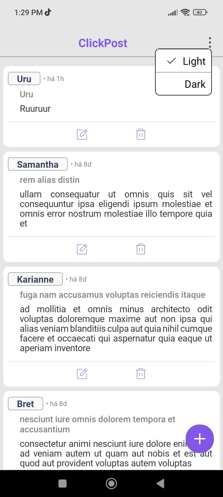
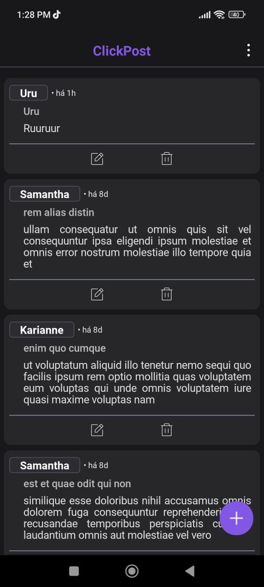
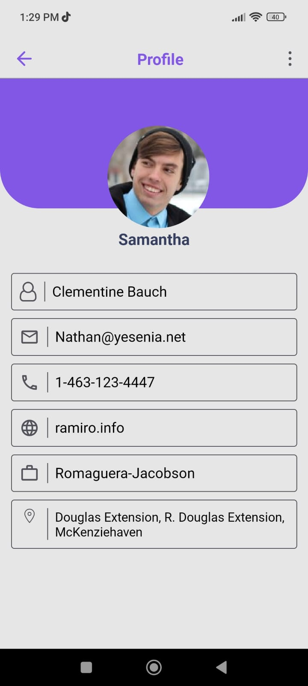
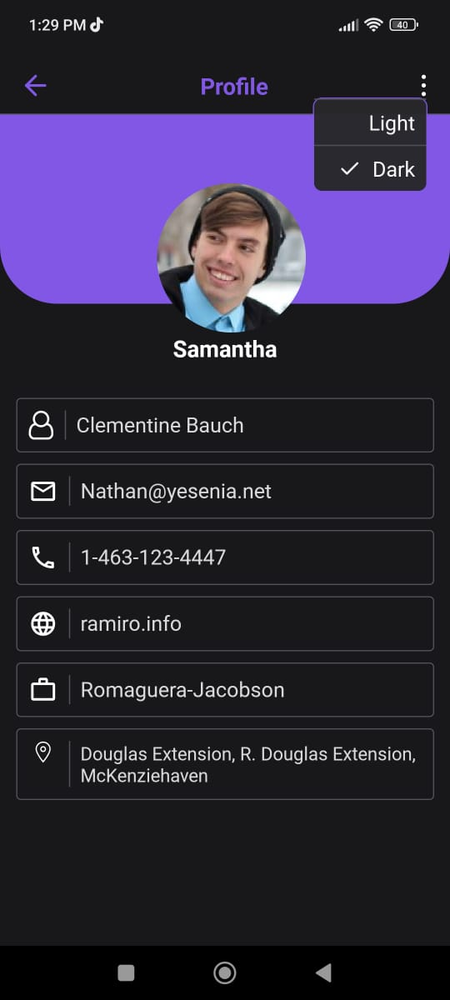
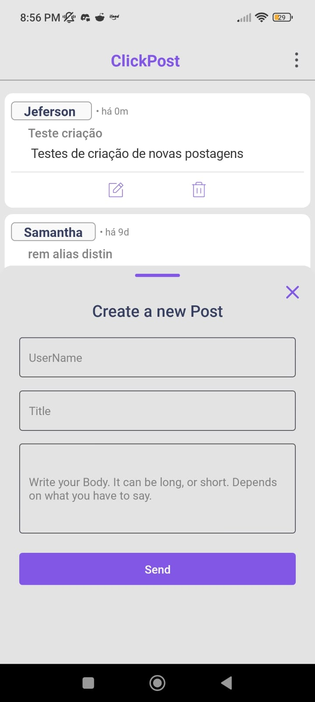
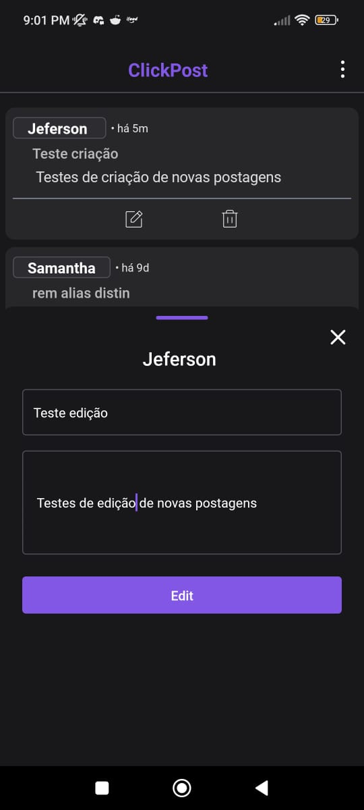
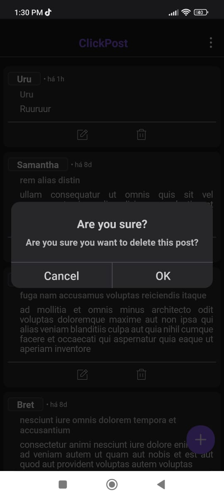

<div align="center">

   

</div>
# Desafio React Native
<h2 align="center">
    ClickPosts
</2>


## Sobre o Projeto
O ClickPost e um aplicativo mobile, feito para consumir uma ipa REST que retorna dados dos posts e os usuários, sendo capaz de visualizar, cadastrar, editar e excluir postagens.


## 🏃‍♂️Como rodar o projeto


## 📃 Requisitos

- Git;
- Node.js;
- npm;
- expo;

Realize um clone deste repositório em sua máquina local:

```bash
git clone https://github.com/Jeferson-BSI/clickPosts.git
```


## Iniciando o App

Abra a pasta `clickPosts` presente no repositório:

```bash
cd clickPosts
```

Instale todas as dependências (preferencialmente pelo npm):

```bash
npm install
```


Inicie o expo `start`

```bash
expo start
```

Abra o aplicativo por meio de um emulador ou de um dispositivo físico (que esteja com o aplicativo oficial do Expo Go instalado).

## Telas do Aplicativo
#### Screen Home
<div align="center" style="width: 300px; height: 300px; margin-right: 30px display: flex; flex-direction: row;">
  
  
</div>

#
#### Screen Profile
<div align="center" style="width: 300px; height: 300px; margin-right: 30px">
  
  
</div>

#
####   Criação de Postagens e Edição
<div align="center" style="width: 300px; height: 300px; margin-right: 30px">
  
  
</div>

#
####   Modal de confirmação
<div align="center" style="width: 300px; height: 300px; margin-right: 30px">
  
</div>